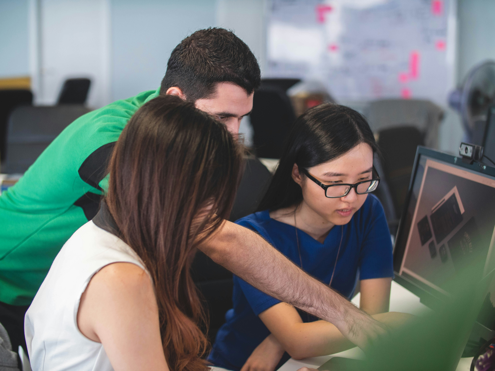
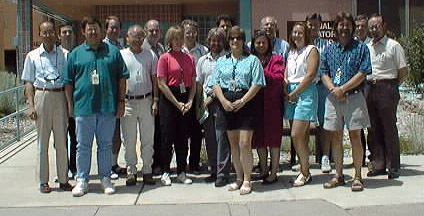

## Introduction

The Carpentries is a registered 501(c)(3) non-profit based in Delaware, USA. The Carpentries teaches foundational coding and data science skills to researchers worldwide. We exist because the skills needed to do computational, data-intensive research are often not included as a part of basic research training in many disciplines. Our global community works together to provide:

- A suite of open source, collaboratively-built, community-developed lessons.
- Evidence-based, proven pedagogical training.
- Workshops based on a learn-by-doing, ‘code with me’ approach.
- A supportive learning culture.
- A global community which subscribes to an inclusive code of conduct.

## Our vision

Our vision is to be the leading inclusive community teaching data and coding skills.

## Our mission

The Carpentries empowers a diverse global community by equipping individuals with essential data and computational skills.  We promote efficient, open, and reproducible research practices.  By fostering collaborative development of openly available lessons and research-informed teaching methods, we build an inclusive network of practictioners and advocates who emphasise the critical role of software and data in advancing research.

## Our values

Shared values and goals have long been the starting point of communities of practice as they identify changes they want to see and start working together towards these changes. The Carpentries community share nine core values.

## At The Carpentries we…


We believe that transparency, honesty, and fairness are keys to fostering trust within an open community.



We help people build knowledge by creating a conducive environment for the exchange of skills, perspectives and experiences that empower people and enable them to reach their potential.



All contributions that follow our Code of Conduct are valuable.



We are responsive, curious, receptive to feedback, and eager to learn.



We welcome and respect all community members, regardless of their identity or expression.



Individuals who make up our community are the most important part of our organisation and our strongest resource.



Accessibility is at our core. We create multiple avenues for participation where all people can learn and contribute.



Collaboration across borders, domains and initiatives is a pathway to empower people and reach shared goals.



We empower a diverse group of people to work with data and code to answer the questions important to them and address challenges in science and society.


* * *

## Our Work

The Carpentries administration and other essential operations are held together by a small [Core Team](/about-us/team/), but the majority of our impact is achieved through the efforts of volunteer participants in our global and local communities. The global [Carpentries community](/community/) consists of Instructors, Trainers, Maintainers, Lesson Developers, Member Organisations, committee or task force members, and other supporters who participate, synchronously or asynchronously, in building our programs for all to share.

## Our History

We have a rich history that dates back to 1998 when Software Carpentry was founded with the mission of teaching lab skills for research computing. At that time, Greg Wilson and Brent Gorda taught workshops to teach researchers software development skills. Greg continued this work, building a collection of collaboratively-developed and openly-available lessons, as well as community of instructors who used those lessons to teach workshops.

  
*Image by Greg Wilson of attendees at the first Software Carpentry workshop in July 1998*

In 2014, Data Carpentry was founded with the mission of building communities teaching universal data literacy. Also in 2014, Library Carpentry was founded with the mission of teaching data skills to people working in library- and information-related roles. Each organisation working in tandem and in partnership to develop lessons and build global communities of practice.

In 2018, Software Carpentry and Data Carpentry merged their projects to form a new project called The Carpentries, under the fiscal sponsorship of Community Initiatives, and shortly thereafter welcomed Library Carpentry as a Lesson Program. In 2025, The Carpentries started operations as an independent 501(c)3 non-profit. 

## Diversity, Equity, and Inclusion Statement

### Our Community is Our Strength

At The Carpentries, we are committed to building a diverse, equitable, and inclusive community that values all individuals and their unique identities. We prioritise accessibility and inclusivity in our curricula and programs and value transparency, fairness, and honesty to build trust within our community. Building an inclusive community is an ongoing process that requires consistent effort and commitment, and we strive for continuous improvement.

### Accessibility Statement

The Carpentries is committed to providing inclusive and accessible content that enables all individuals, including those with disabilities, to participate and engage fully. We are actively working to increase the accessibility and usability of Carpentries’ content and in doing so adhere to many of the available standards and guidelines including those from the World Wide Web Consortium.

If there are any aspects of our community including the website, community discussions, instruction, or the design of our lessons that result in barriers to your inclusion, please [email us](mailto:) with as much information as possible including the name, location, and date of the event you attended, or any relevant links that provide context (e.g. Slack, GitHub).

### Request an accommodation

At The Carpentries, we are committed to building a diverse, equitable, and inclusive community that values all individuals and their unique identities. We prioritise accessibility and inclusivity in our curricula and programs and value transparency, fairness, and honesty to build trust within our community. Building an inclusive community is an ongoing process that requires consistent effort and commitment, and we strive for continuous improvement.

To request an accommodation for a Carpentries event, please fill out the [accommodation request form]().

If you have questions or need assistance with the accommodation form please [email us](mailto:).

### Resources

[The Toolkit of IDEAS](https://zenodo.org/records/10391883) (Inclusion, Diversity, Equity and Accessibility Strategies) is a practical resource for Carpentries’ Instructors, helpers, and workshop hosts. We know that many people care about inclusion, diversity, equity and accessibility but are not sure how it connects to teaching foundational coding and data science skills. This toolkit aims to bridge this gap.
