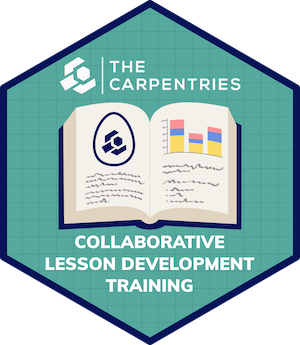
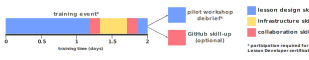

The Carpentries hosts a thriving curriculum development community. Lesson developers collaborate on new lessons in [The Carpentries Incubator](). Mature lessons can be submitted for open peer review in [The Carpentries Lab]() and/or may be adopted by one of our lesson programs.

The successful design and collaborative development of a new lesson or curriculum requires specialised knowledge and skills. The Carpentries Collaborative Lesson Development Training provides our community members with the expertise they need to co-create a high-quality curriculum.

The Lesson Developer Handbook provides detailed information, resources, and other documentation for community members who want to get involved with curriculum development.

## Collaborative Lesson Development Training

Collaborative Lesson Development Training teaches essential skills
and good practices for designing and developing a lesson as an open source project. The training will guide you through the design process and initial development of a new lesson, prepare you to work with the infrastructure we use to build accessible, open-source lesson websites, and provide some advice and techniques for effective collaboration on the project.

[Visit the training curriculum]().

### Target audience

Collaborative Lesson Development Training is aimed at Carpentries community members who have an idea for a new lesson and want to begin developing it into an open source lesson website, in collaboration with others. The training focus on lessons for short-format training (e.g. two-day workshops), but most of the skills and principles taught apply to all curriculum designs.  Trainees join in teams of two to five people, and at least one member of each team should have attended [Instructor Training](/instructor-training/).

### What will you learn?
Collaborative Lesson Development Training teaches fundamental concepts, skills, and good practice in three key areas:

* Lesson design and development.
* Collaboration.
* Using The Carpentries lesson infrastructure.

After attending this training, participants will be able to:

- collaboratively develop and publish lessons using The Carpentries lesson infrastructure.
- identify and characterise the target audience for a lesson.
- define SMART learning objectives.
- explain the pedagogical value of authentic tasks.
- create exercises for formative assessment.
- explain how considerations of cognitive load should influence the pacing, length, and organisation of a lesson.
- use best practices to configure and maintain accessible and usable lesson repositories that are readily available for collaboration.
- identify and correct accessibility issues in a lesson built on The Carpentries lesson infrastructure.
- use feedback and reflection from teaching to update and improve lesson material.
- review and provide constructive feedback on lessons.

### Training structure

During the training, trainees will learn about backward lesson design, including techniques for the development of effective exercises and accessible lesson content. They will define the target audience and intended learning outcomes of their lesson, produce an outline of the lesson content and narrative, and prepare exercises and examples for a chosen section. They will also be introduced to [The Carpentries Workbench](), the infrastructure that the community uses to create lessons. Applying these skills as they learn, trainees will begin building their new material into an open source lesson website.

Trainees are encouraged to trial part of their new lesson after the training, using this opportunity to gather vital feedback on their lesson design. To complete their certification, they are required to participate in a debrief session, hosted by a Lesson Developer Trainer, where they reflect on the experience of trying out their new lesson and plan next steps for the completion and improvement of the new curriculum.

Trainees are also eligible to join an optional _GitHub Skill-up_ session, included in the price of the training. These skill-up sessions are recommended for any trainees who are not already using GitHub for collaborative development on a regular basis.

## Pricing

Consult our [pricing page](/support/pricing) for our current fee structure.

## Register

Collaborative Lesson Development Training events are regularly scheduled throughout the year. Send an email to [](mailto:) to register your interest in joining Collaborative Lesson Development Training.

## Request an Accommodation 



## Contact Us

Have Questions? Please consult our [Collaborative Lesson Development FAQ](/lesson-development/cldt-faq/) or  contact our team at [](mailto:).