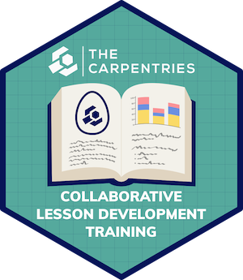

**Currently inactive: the Collaborative Lesson Development Training program is paused and we are not scheduling any new training events at this time.**

The Carpentries hosts a thriving curriculum development community. Lesson developers collaborate on new lessons in [The Carpentries Incubator](). 

The successful design and collaborative development of a new lesson or curriculum requires specialised knowledge and skills.

## Lesson Developer Handbook

[The Lesson Developer Handbook](https://docs.carpentries.org/handbooks/lesson_developers.html) provides detailed information, resources, and other documentation for community members who want to get involved with curriculum development.

## Collaborative Lesson Development Training

Collaborative Lesson Development Training teaches essential skills
and good practices for designing and developing a lesson as an open source project. The training guides you through the design process and initial development of a new lesson, prepares you to work with the infrastructure we use to build accessible, open-source lesson websites, and provides some advice and techniques for effective collaboration on the project.

**The Collaborative Lesson Development Training program is currently paused** but [the training curriculum]() remains available as a valuable reference for lesson developers.
Further details about the training are provided below, to help you decide whether the training curriculum will be a helpful resource for you.

### Target audience

Collaborative Lesson Development Training is aimed at Carpentries community members who have an idea for a new lesson and want to begin developing it into an open source lesson website, in collaboration with others. The training focuses on lessons for short-format training (e.g. two-day workshops), but most of the skills and principles taught apply to all curriculum designs.  Trainees join in teams of two to five people, and at least one member of each team should have attended [Instructor Training](/instructor-training/) or [Learner-Centered Teaching](/learner-centered-teaching/).

### What will you learn?
Collaborative Lesson Development Training teaches fundamental concepts, skills, and good practice in three key areas:

* Lesson design and development.
* Collaboration.
* Using The Carpentries lesson infrastructure.

After following this training, participants will be able to:

- collaboratively develop and publish lessons using The Carpentries lesson infrastructure.
- identify and characterise the target audience for a lesson.
- define SMART learning objectives.
- explain the pedagogical value of authentic tasks.
- create exercises for formative assessment.
- explain how considerations of cognitive load should influence the pacing, length, and organisation of a lesson.
- use best practices to configure and maintain accessible and usable lesson repositories that are readily available for collaboration.
- identify and correct accessibility issues in a lesson built on The Carpentries lesson infrastructure.
- use feedback and reflection from teaching to update and improve lesson material.
- review and provide constructive feedback on lessons.

## Contact Us

Have Questions? Please consult our [Collaborative Lesson Development FAQ](/lesson-development/cldt-faq/) or  contact our team at [](mailto:).
