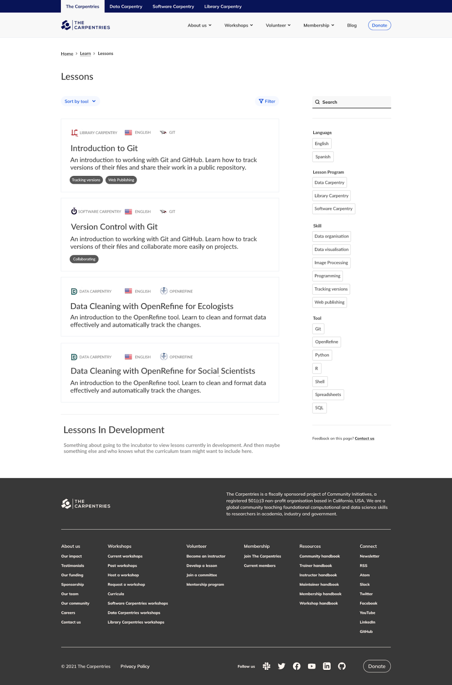

The lessons page should look like this (image below) using `lessons.csv` saved in `content/lessons` for now as Hugo does not seem to like having csv data in the `data` folder.  We can convert to `yaml` or create another folder for `csv` data.

We do not need the sort/filter buttons at the top.

The filters on the side can be dropdows just like on the workshops page.

